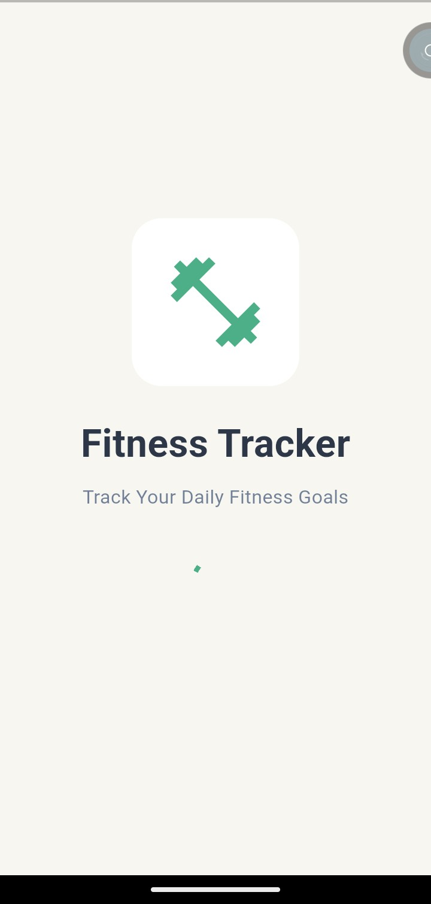
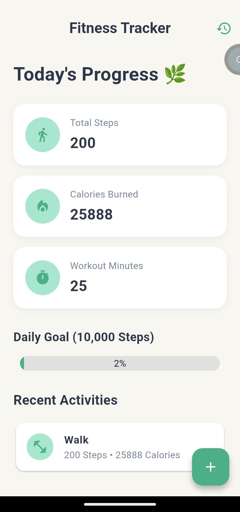
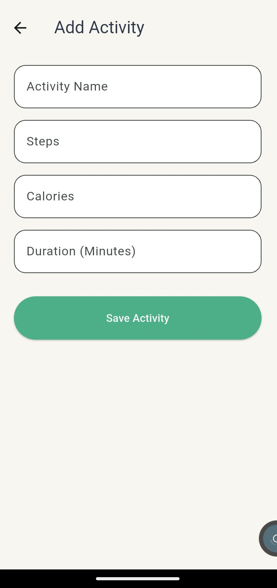
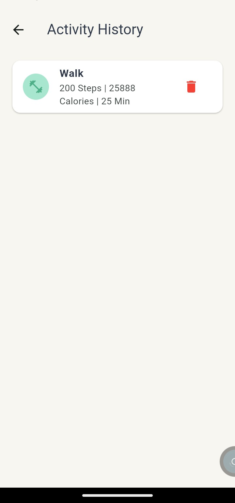

# 🏃‍♀️ CodeAlpha Fitness Tracker App

A modern Flutter-based fitness tracking application developed as part of the **CodeAlpha App Development Internship**.

The app helps users record and manage their daily fitness activities, including steps, calories burned, and workout duration. All data is stored locally using **SQLite**, providing a fast and reliable offline experience.

---

## ✨ Features

* ➕ Add New Fitness Activities
* 👀 View Saved Activities
* ✏️ Edit Activity Details
* 🗑️ Delete Activities
* 🔍 Track Steps, Calories & Duration
* 💾 Offline Data Storage using SQLite
* 🎨 Clean & Responsive UI
* ⚡ Smooth User Experience

---

## 🛠️ Tech Stack

* Flutter
* Dart
* SQLite (sqflite)
* Material Design

---

## 📸 App Screenshots

<p align="center">
  
  
</p>

<p align="center">
  
  
</p>

---

## 📂 Project Structure

```text
lib/
├── models/
├── database/
├── screens/
├── widgets/
└── main.dart
```

## 🚀 Getting Started

Clone the repository:

```bash
git clone https://github.com/fatima-awais1122/codealpha_fitness_tracker.git
```

Install dependencies:

```bash
flutter pub get
```

Run the application:

```bash
flutter run
```

---

## 👩‍💻 Developed By

**Fatima Awais**

---

## 📄 License

This project was developed for learning purposes as part of the **CodeAlpha App Development Internship**.
